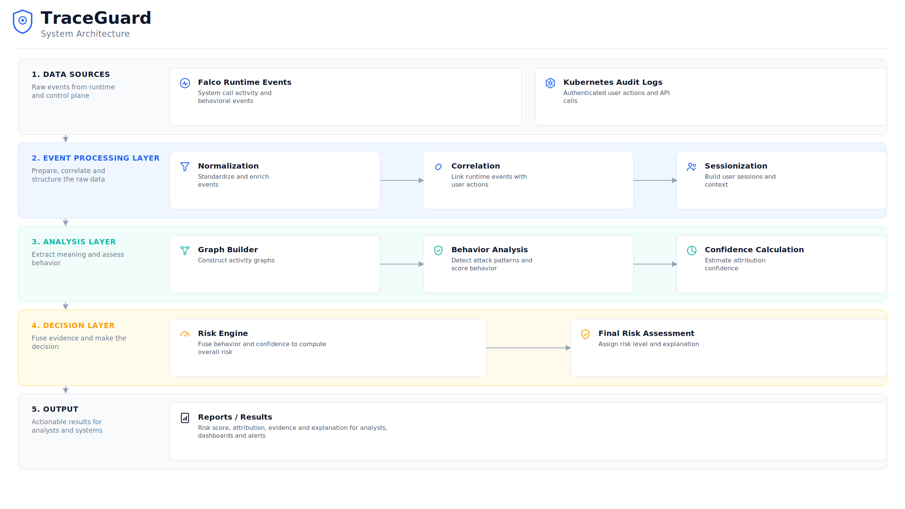

# TraceGuard

Behavior-based security monitoring for Kubernetes that connects runtime attacks to the users responsible for them.


> **Status:** Experimental. Validated against controlled evaluation scenarios, **not** production-hardened or independently security-audited. See [Security & Data Handling](#security--data-handling) before deploying against a real cluster.

---

## Table of Contents

- [Overview](#overview)
- [Why TraceGuard?](#why-traceguard)
- [Key Features](#key-features)
- [Architecture](#architecture)
- [Workflow](#workflow)
- [Repository Structure](#repository-structure)
- [Installation](#installation)
- [Usage](#usage)
- [Example Output](#example-output)
- [Security & Data Handling](#security--data-handling)
- [Documentation](#documentation)
- [Contributing](#contributing)
- [Built With](#built-with)
- [Roadmap](#roadmap)
- [License](#license)
- [Author](#author)

---

## Overview

TraceGuard is a behavior-based monitoring framework for Kubernetes that closes the gap between **what happened inside a container** and **who caused it**. It combines runtime events from [Falco](https://falco.org) with Kubernetes audit logs through a seven-stage pipeline, turning two disconnected data sources into a single, explainable security decision.

Instead of a binary "attack / no attack" verdict, TraceGuard scores two things independently: how malicious an activity looks, and how confident the system is about who did it. Both feed into a final risk classification, so an analyst never loses sight of dangerous behavior just because attribution is uncertain.

The pipeline was validated using controlled scenarios covering delayed execution, attribution ambiguity, session fragmentation, noisy benign activity, partial attacks, and missing evidence.

---

## Why TraceGuard?

Kubernetes security tooling today is split into two camps that don't talk to each other:

- **Runtime tools (Falco, etc.)** see suspicious syscalls, file access, and network activity inside containers — but have no idea which authenticated user triggered them.
- **Kubernetes audit logs** know exactly which user made which API request — but have zero visibility into what actually happened at the process level inside the pod.

The result is an **attribution gap**: teams can detect that something bad happened, or who was active at the time, but rarely both — especially in shared clusters where multiple users touch the same workloads.

Existing commercial platforms narrow this gap but typically rely on proprietary, opaque scoring. Provenance-graph approaches add context but are often not Kubernetes-native and skip user attribution entirely.

TraceGuard closes this gap directly: correlate runtime behavior with authenticated identity, quantify how reliable that correlation is, and produce a risk score with a transparent path from raw event to final decision.

---

## Key Features

- **Runtime + audit fusion** — merges Falco events and Kubernetes audit logs into one normalized event schema
- **User attribution engine** — links suspicious behavior to a responsible user across four attribution states: `strong_match`, `weak_match`, `collision`, `unmatched`
- **Session-based analysis** — groups related activity by user, pod, and namespace instead of scoring isolated alerts
- **Local Execution Graphs** — builds per-session process-relationship graphs for contextual evidence
- **Multi-factor confidence model** — quantifies attribution reliability across five independent dimensions (timing, sequence, continuity, ambiguity, process relationships)
- **Explainable risk engine** — every decision is traceable to its contributing sub-scores; no black-box scoring
- **Attribution-aware risk fusion** — weak attribution lowers certainty about *who* did it without hiding *that* something malicious happened
- **Rule-based, self-calibrating** — no labeled training dataset required to get started

---

## Architecture




TraceGuard processes events through a linear seven-stage pipeline. Falco events and Kubernetes audit logs enter at the top; a normalized, correlated, and risk-scored decision comes out the bottom, with explainability preserved at every stage.

```
Falco Events + K8s Audit Logs
        │
        ▼
 1. Normalization
        │
        ▼
 2. Correlation (attribution)
        │
        ▼
 3. Sessionization
        │
        ▼
 4. Graph Building
        │
        ▼
 5. Behavior Analysis ──┐
                         ├──► 7. Risk Engine ──► LOW / MEDIUM / HIGH
 6. Confidence Calc  ────┘
```

Full architectural details, data schemas, and stage I/O contracts: [`docs/architecture.md`](docs/architecture.md).

---

## Workflow

| Stage | Purpose |
|---|---|
| **1. Normalization** | Standardizes Falco events and Kubernetes audit logs into one unified event schema |
| **2. Correlation** | Matches runtime events to authenticated users based on timing and resource identity, assigning an attribution state |
| **3. Sessionization** | Groups correlated events into behavioral sessions per user, pod, and namespace |
| **4. Graph Building** | Constructs a Local Execution Graph per session to capture process relationships |
| **5. Behavior Analysis** | Scores session severity using pattern detection, classification, and partial-attack indicators |
| **6. Confidence Calculation** | Estimates attribution reliability from five independent evidence components |
| **7. Risk Engine** | Fuses behavior and confidence into a final, explainable LOW / MEDIUM / HIGH risk decision |

Detailed formulas and per-stage logic: [`docs/pipeline.md`](docs/pipeline.md).
---

## Repository Structure

```text
TraceGuard/
├── src/                 # Core pipeline implementation
├── docs/                # Architecture, pipeline, design decisions, validation
├── images/              # Documentation diagrams and figures
├── .gitignore
├── LICENSE
├── README.md
└── requirements.txt
```

---

## Installation

> These steps describe the intended developer workflow for running the pipeline from source. TraceGuard is not yet published as a packaged CLI or PyPI release — clone and run locally.

```bash
git clone https://github.com/<your-org>/traceguard.git
cd traceguard

python3 -m venv venv
source venv/bin/activate

pip install -r requirements.txt
```

**Requirements:**
- Python 3.10+
- A Kubernetes cluster (or [kind](https://kind.sigs.k8s.io/) for local testing)
- Falco deployed on the target cluster
- Access to Kubernetes API audit logs

---

## Usage


TraceGuard currently operates on exported Falco runtime events and Kubernetes audit logs.

To execute the pipeline, provide a pair of compatible Falco and Kubernetes audit log files to the processing entry point.

Example datasets are not included in this initial release and will be added in a future update.

---

## Example Output


Sample risk decision (illustrative — actual field values depend on input data):

```json
{
  "session_id": "sess-8841",
  "user": "alice",
  "attribution_state": "strong_match",
  "behavior_score": 0.87,
  "confidence_score": 0.91,
  "risk_score": 0.88,
  "risk_level": "HIGH",
  "triggered_patterns": ["reverse_shell", "suspicious_interpreter"]
}
```

---

## Security & Data Handling

TraceGuard reads sensitive operational data — Kubernetes audit logs and container runtime events — so treat it accordingly:

- **Least privilege:** deploy with a read-only service account scoped to audit log and Falco event access; TraceGuard does not require write access to cluster resources.
- **Data minimization:** the pipeline processes event metadata (process names, timestamps, pod/namespace identifiers) for attribution — it is not designed to log payload content or secrets.
- **Not production-audited:** this project has been validated against controlled scenarios, not a penetration-tested or independently security-reviewed tool. Do not treat its output as a sole source of truth for incident response.
- **Informed consent:** if deploying in a shared or organizational cluster, ensure users are aware of behavioral monitoring per your organization's policies.


---

## Documentation

The README covers the essentials — deeper technical material lives in `/docs`:

| Document | Contents |
|---|---|
| [`docs/architecture.md`](docs/architecture.md) | Full pipeline architecture, data flow, and schemas |
| [`docs/pipeline.md`](docs/pipeline.md) | Stage-by-stage implementation details (correlation, sessionization, graph building) |
| [`docs/validation.md`](docs/validation.md) | Evaluation scenarios, methodology, and results |
| [`docs/design-decisions.md`](docs/design-decisions.md) |  Engineering rationale behind key design choices |

---

## Contributing

Contributions, issue reports, and design discussions are welcome.

1. Fork the repo and create a feature branch
2. Follow existing module boundaries (see [`docs/architecture.md`](docs/architecture.md))
3. Add scenario-based tests for new detection logic where possible
4. Open a PR describing the behavior change and its evaluation impact

A formal `CONTRIBUTING.md` and issue templates are planned — see [Roadmap](#roadmap).

---

## Built With

- **Python 3.10+** — pipeline implementation
- **[Falco](https://falco.org)** — runtime syscall monitoring
- **Kubernetes API / Audit Logs** — user attribution source
- **NetworkX** — Local Execution Graph construction and analysis

---

## Roadmap

- [ ] Live-cluster ingestion (streaming Falco + audit log tailing)
- [ ] Results visualization dashboard
- [ ] Machine learning module to complement rule-based behavior detection
- [ ] `CONTRIBUTING.md`, issue templates, and `SECURITY.md`


---

## License

Released under the [MIT License](LICENSE).

---


## Author

**Montaha Abu Aisha**
Cloud Security | Cybersecurity | Networking

CCNA • Cisco CyberOps

[LinkedIn](www.linkedin.com/in/montaha-abo-aisha-589a032b8) · [GitHub](https://github.com/montaha-abo-aisha)