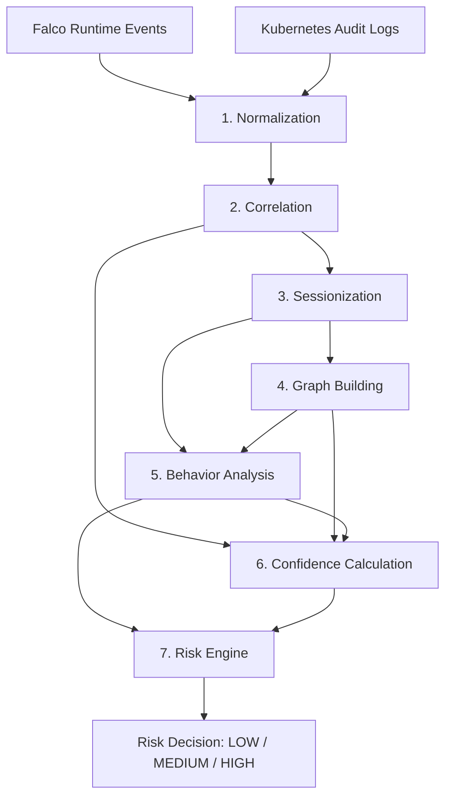
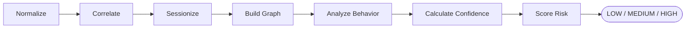

# TraceGuard Architecture

## Overview

TraceGuard is a behavior-based security monitoring system for Kubernetes environments. It closes a gap that most runtime security tooling leaves open: Falco can tell you *what* happened inside a container, and the Kubernetes audit log can tell you *who* did something through the API — but nothing in the default stack reliably connects the two. An attacker who pops a shell inside a pod leaves a Falco trail; the `kubectl exec` that got them there leaves an audit trail. Without correlating those two records, an analyst is left guessing at attribution.

TraceGuard ingests both event streams and pushes them through a seven-stage pipeline that normalizes, correlates, sessionizes, and scores the activity, producing a final risk decision that is fully explainable — every score can be traced back to the raw evidence that produced it.

## Architecture Goals

The design is guided by a small set of goals that shape most of the decisions below:

- **Explainability** — every score in the system carries the sub-scores and evidence behind it, so a final decision can always be traced back to raw events.
- **Separation of concerns** — "is this malicious" and "who did this" are evaluated independently and only combined at the last stage.
- **Modular design** — each stage has a defined input/output contract and can be built, tested, and reasoned about on its own.
- **Extensibility** — rule-based components are isolated so they can be replaced or supplemented (e.g., with learned models) without touching the rest of the pipeline.
- **Maintainability** — stages communicate through stable schemas, so internal changes to one stage don't ripple through the others.
- **Clear attribution** — attribution confidence is scored explicitly rather than assumed, and ambiguous or missing evidence is reflected in the score instead of hidden.
- **Reliable risk assessment** — behavior severity and attribution confidence are fused deliberately, not averaged blindly, so a risk decision reflects both how bad an action looks and how sure the system is about who did it.

## Design Philosophy

Three ideas drive most of the architectural decisions in this system:

- **Behavior and attribution are different questions.** Whether an action is malicious and who performed it are evaluated by separate subsystems that never collapse into a single opaque number until the very last stage. This keeps a low-confidence attribution from hiding a high-severity attack.
- **Every score should be explainable.** Nothing in the pipeline outputs a bare number without the sub-scores and triggered rules that produced it. An analyst reading a risk decision should never have to trust a black box.
- **The pipeline should degrade gracefully.** Kubernetes environments are messy — fields go missing, clocks drift, sessions fragment. Rather than failing closed or open, TraceGuard treats missing or weak evidence as a confidence penalty, not a hard stop.

## Technology Stack

| Layer | Technology | Purpose | Why It Was Chosen |
|---|---|---|---|
| Runtime event source | Falco | Captures syscall-level runtime behavior inside containers | De facto standard for Kubernetes runtime detection, with a mature rule engine and wide adoption |
| Attribution source | Kubernetes Audit Logs | Captures authenticated API-server activity | Native to Kubernetes, so no extra collection agent is needed to get identity context |
| Orchestration platform | Kubernetes (K3s) | Deployment and validation environment for the pipeline | Lightweight distribution that mirrors upstream Kubernetes behavior while keeping local validation fast |
| Pipeline implementation | Python | Core language for all seven pipeline stages | Fast to iterate on scoring logic and schema handling, with a mature data-processing ecosystem |
| Interchange format | JSON | Event, schema, and pipeline output serialization | Native fit for both Falco and Kubernetes audit output, and easy to inspect during debugging |
| Documentation | Mermaid | Logical diagrams embedded in project docs | Renders directly in GitHub markdown, so diagrams stay versioned alongside the code they describe |

## High-Level Architecture

The diagram below is the primary architectural view of the system. The Mermaid flowchart that follows it is a simplified logical representation of the same pipeline, useful for reading alongside the code rather than as a replacement for the full diagram.

TraceGuard is a linear, seven-stage pipeline. Each stage consumes the output of the previous stage and adds a specific layer of context, moving from raw, heterogeneous events to a single explainable risk decision.

## Core Components

### 1. Normalization Layer

Falco syscall events and Kubernetes audit log entries are structurally different, and the first job of the pipeline is collapsing them into a single, unified schema.

- **Consumes:** Raw Falco events, raw Kubernetes audit log entries.
- **Produces:** `NormalizedEvent` records with a consistent field set (timestamp, resource identity, actor, action, source).

This layer handles field mapping, timestamp normalization, and resource identity extraction (pod, namespace, container), and it also absorbs schema drift — if a field like `proc_cmdline` is null, downstream stages fall back to an `action`-based representation instead of failing outright. Normalization is the only component that talks directly to raw event sources, which keeps the rest of the pipeline source-agnostic and means new event sources can be added here without touching later stages.

### 2. Correlation Layer (Attribution)

This stage answers a single question: which Kubernetes user is most likely responsible for a given runtime event?

For each Falco event, the correlation layer searches the audit log for candidate entries using temporal proximity and resource identity (pod, namespace). Each candidate is scored, and the event is assigned one of four attribution states:

- `strong_match`
- `weak_match`
- `collision`
- `unmatched`

Primary input is the stream of `NormalizedEvent` records; the result is a set of `CorrelatedEvent` records containing candidate users, per-candidate attribution scores, an ambiguity measurement, and a final attribution state. That attribution state and ambiguity score feed directly into Sessionization and, later, into Confidence Calculation.

### 3. Sessionization

Individual events are noisy to evaluate in isolation, so correlated events are grouped into coherent windows of user activity before any behavioral judgment is made.

Events are ordered chronologically within a `(user, pod, namespace)` key and split into distinct sessions whenever the gap between consecutive events exceeds a configurable inactivity threshold.

Processing context here is the stream of `CorrelatedEvent` records; the generated output is a set of sessions keyed by `(user, pod, namespace)`. Sessions are the unit of analysis for every stage downstream — Graph Building, Behavior Analysis, and Confidence Calculation all operate at the session level, not the individual event level.

### 4. Graph Building (Local Execution Graph)

Chronological ordering alone doesn't capture how processes within a session relate to each other, so this stage builds a Local Execution Graph per session — nodes are processes, edges are execution relationships (spawn, exec, file access).

Sessions are the input; the result is one Local Execution Graph per session. Parent-child and dependency edges are built between processes observed in a session, with edge weights capturing how strongly two processes are related: temporal proximity, semantic transition, continuity, and burst behavior all factor in.

**Downstream usage:** the resulting graph feeds both Behavior Analysis, where unexpected relationships raise suspicion, and Confidence Calculation, where strong, coherent dependency chains raise attribution confidence via the Process Relationship Score.

### 5. Behavior Analysis

**Purpose:** determine whether the activity in a session resembles a known attack pattern, independent of who performed it.

Sessions and their execution graphs go in; what comes out is a behavior severity score in `[0, 1]`, plus the specific patterns and indicators that triggered it. Three perspectives are combined to get there: pattern detection against known malicious sequences (reverse shells, cryptojacking), behavior classification for overall severity, and partial indicator assessment for incomplete attack chains that still carry evidentiary value.

This stage feeds the Risk Engine directly, and also feeds Confidence Calculation indirectly through the graph and correlation context it shares.

### 6. Confidence Calculation

Behavior Analysis answers "how bad does this look" — Confidence Calculation answers "how sure are we who did it," and the two are kept deliberately separate.

- **Inputs:** Correlation output, graph output, and session context.
- **Result:** A confidence score in `[0, 1]`, decomposed into five components: Timing, Sequence, Continuity, Ambiguity, and Process Relationship Strength (PRS).

Each of the five sub-scores is computed independently, averaged into a base confidence value, and adjusted when temporal correlation is especially strong. Its output is one of the two inputs to the Risk Engine.

### 7. Risk Engine

The terminal stage fuses behavior severity and attribution confidence into a single, explainable risk decision.

Taking the behavior score and confidence score as input, it applies a weighted fusion of the two, then buckets the result against fixed thresholds to produce a risk score in `[0, 1]` and a classification of LOW, MEDIUM, or HIGH. Every decision retains the full breakdown of contributing sub-scores for later inspection — this is what analysts and downstream alerting ultimately consume.

## End-to-End Architecture Flow

Falco events and Kubernetes audit logs enter the pipeline and are normalized into a common schema. From there, the correlation layer attempts to attribute each runtime event to an authenticated user, and correlated events are grouped into sessions representing continuous activity. An execution graph is built per session to capture process relationships, which behavior analysis then uses to score the session's malicious severity. In parallel, confidence calculation scores the reliability of the attribution behind that session. The risk engine combines both scores into a final, explainable decision.

## Design Principles

**Explainability.** Every stage preserves the sub-scores and evidence that produced its output. Nothing is discarded on the way to the final decision — a HIGH risk classification can always be traced back to the specific patterns and confidence components that produced it.

**Modularity.** Each stage is a self-contained unit with a defined input and output contract. This made it possible to build, test, and validate stages independently before wiring them into the full pipeline, and it keeps the boundary between "is this malicious" and "who did this" architecturally enforced rather than just conventionally observed.

**Maintainability.** Because stages communicate through well-defined schemas (`NormalizedEvent`, `CorrelatedEvent`, sessions, graphs), a change to one stage's internal logic doesn't ripple through the rest of the pipeline as long as the contract holds.

**Extensibility.** The rule-based detection in Behavior Analysis and the fixed formulas in Confidence Calculation are intentionally isolated in their own modules, so either can be swapped for a learned model later without touching correlation, sessionization, or the risk engine.

**Testability.** Because every stage has a clearly defined input and output contract, each one can be exercised in isolation — feeding a stage a fixed set of sessions, graphs, or correlated events and checking its output against expected values, without standing up the full pipeline. This keeps regressions localized to the stage that introduced them instead of surfacing only as an unexplained shift in the final risk score.

## Scalability Considerations

The current implementation was validated in a single-cluster environment, and the pipeline's scaling profile follows directly from which stages hold state and which don't.

Normalization, Correlation, and Behavior Analysis are largely stateless per event or per session and can be parallelized without much coordination overhead. Sessionization and Graph Building, by contrast, are the two components most sensitive to event volume, since both hold in-memory context for the duration of a session — a long-lived or high-throughput session means a longer-lived graph and more accumulated state to carry.

Because sessions are already keyed by `(user, pod, namespace)`, that key is also the natural sharding boundary for horizontal scaling: partitioning work at the sessionization stage would let session state and graph construction be distributed across workers without splitting a single session's context across nodes. Confidence Calculation and the Risk Engine, downstream of sessionization, are comparatively lightweight and would scale along with however sessionization is partitioned.

Distributed processing across multiple workers or nodes hasn't been implemented yet — the current deployment is single-process within a single cluster — but the session-keyed structure of the pipeline was chosen with that path in mind.

## Current Limitations

- Attribution and behavioral detection both depend on the availability and quality of Falco and audit log evidence; missing data reduces confidence rather than blocking a decision, but it does reduce it.
- Detection logic is rule-based against known patterns. Novel attack techniques that don't match existing patterns won't be flagged by Behavior Analysis.
- Session and graph state are held in memory for the duration of a session, which ties resource usage to session volume and duration rather than to a fixed budget.
- Thresholds (behavior/pattern thresholds, inactivity gaps) are manually tuned rather than learned, so they may need adjustment for workloads that differ significantly from the validated scenarios.
- The system has been validated against controlled scenarios, not large-scale production traffic.
- Deployment scope so far is single-cluster; cross-cluster correlation is not implemented.

## Future Architectural Improvements

- Introduce a learned anomaly detection component alongside the existing rule-based engine to catch previously unseen attack patterns.
- Move toward plugin-based detection modules, so new pattern sets or classifiers can be registered without modifying the Behavior Analysis core.
- Extend correlation and sessionization to operate across multiple clusters.
- Distribute session state and graph construction across workers, using the `(user, pod, namespace)` key as the natural partitioning boundary.
- Support additional runtime event sources beyond Falco, normalized through the existing schema-mapping layer.
- Replace manually tuned thresholds (behavior/pattern thresholds, inactivity gaps) with adaptive, workload-aware calibration.
- Build real-time dashboards on top of the existing explainable output, rather than reviewing risk decisions after the fact.

## Related Documentation

The reasoning behind specific design tradeoffs — why particular thresholds, scoring formulas, or attribution states were chosen — is documented separately in `design-decisions.md`. Implementation-level detail for each pipeline stage, including module boundaries and internal data flow, lives in `pipeline.md`.
