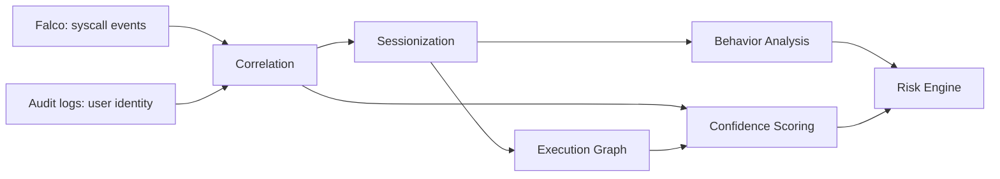

# Design Decisions

## Design Philosophy

Most of the decisions below trace back to one recurring tension: behavioral detection and user attribution are both uncertain processes, and collapsing that uncertainty into a single score too early throws away information an analyst actually needs. TraceGuard is built around keeping those two forms of uncertainty separate for as long as possible, and only fusing them at the very end, in a way that's explainable and reversible in the analyst's head.

## Engineering Principles

A handful of principles recur across every stage of the pipeline and explain why the architecture looks the way it does:

- **Separation of Concerns** — behavior severity, attribution confidence, and structural relationships are each computed independently, then combined deliberately rather than mixed together implicitly.
- **Explainability** — every stage keeps its sub-scores and triggered rules visible instead of collapsing them into an opaque number, so a decision can be traced back to its cause.
- **Modular Design** — each pipeline stage has a defined input/output contract, so internal logic can change without rippling into neighboring stages.
- **Deterministic Processing** — rule-based logic and fixed, documented thresholds are favored over black-box models, keeping outputs reproducible and auditable.
- **Extensibility** — stages like behavior analysis are built so a rule-based engine can later be replaced or augmented (e.g., with a learned model) without redesigning the pipeline around it.
- **Independent Validation** — modularity isn't just an implementation convenience; it's what let each stage be stress-tested against its own dedicated evaluation scenario before end-to-end integration.

## Decision Summary

| Decision | Problem Addressed | Selected Approach |
|---|---|---|
| Runtime evidence source | Need low-footprint visibility into container-level activity | Falco (eBPF, syscall-level) |
| Identity source | Falco has no concept of Kubernetes identity | Kubernetes audit logs, joined via correlation |
| Event schema | Falco and audit logs share no common structure | Single `NormalizedEvent` schema, centralized normalization |
| Stage ordering | Behavior scoring needs session boundaries to be meaningful | Correlation and sessionization run before behavior analysis |
| Event grouping | Isolated events miss multi-step attack progression | Sessions keyed by `(user, pod, namespace)`, split on inactivity |
| Structural relationships | Sessions don't capture which process spawned which | Local Execution Graph with weighted edges |
| Attribution reliability | Discrete match states hide how strong a match really is | Five-component continuous confidence model |
| Behavior vs. confidence | Weak attribution shouldn't suppress a real attack | Scored independently, fused only at the Risk Engine |
| Risk fusion | How to combine severity and confidence into one number | Weighted fusion, `0.7 × Behavior + 0.3 × Confidence` |
| Attack classification | ML needs labeled data the project doesn't have | Rule-based detection with dual-threshold strategy |
| Codebase structure | Stages need to be buildable and testable in isolation | Modular pipeline with strict schema contracts |
| Output interpretability | An opaque score isn't useful for incident investigation | Explainable scoring at every stage |

## Why Falco

Falco was chosen as the runtime evidence source because it operates at the syscall level via eBPF, which means detection doesn't depend on a workload consuming enough CPU or memory to trip a resource-based alert. A file access, reverse shell, or process injection shows up whether or not it moves any dashboard needle. The alternative — relying on Kubernetes' built-in resource metrics — was rejected early because it misses exactly the kind of quiet, low-footprint activity that matters most for insider threat and post-compromise detection.

The trade-off is that Falco has no concept of Kubernetes identity. It sees the syscall, not the user. That gap is precisely what the Correlation stage was built to close.

## Why Kubernetes Audit Logs

Audit logs were the natural complement to Falco: they carry authenticated user identity, which Falco lacks, but they lack any visibility into what actually happened inside a container at the process level. Neither source is sufficient on its own — audit logs alone can't tell you if a `kubectl exec` session was used to drop a payload; Falco alone can't tell you who dropped it. Using both, joined through correlation, was the only option that closed the attribution gap without inventing a new data source.

## Why Event Normalization

Falco events and audit log entries have almost nothing in common structurally: different field names, different semantics, different granularity. Rather than have every downstream stage understand both formats, a single normalization layer maps both into one `NormalizedEvent` schema. Letting correlation, sessionization, and behavior analysis each parse both source formats independently would have triplicated the same brittle parsing logic and tripled the surface area for schema-drift bugs — a risk that materialized directly, in the form of a null `proc_cmdline` field, and was handled once, centrally, instead of three separate times.

## Why Correlation Comes Before Behavior Analysis

Attribution is resolved before severity is scored so that sessionization — which groups events by `(user, pod, namespace)` — has a user to key on in the first place. Running behavior analysis first and correlating afterward would mean scoring behavior on an unstructured event stream with no session boundaries, losing the behavioral context that makes pattern detection meaningful.

## Sessions Instead of Isolated Events

Scoring individual events independently misses the point of the analysis: a `python -c` invocation followed by a `curl` and then a reverse shell is a meaningfully different signal than any one of those events alone. Grouping correlated events into sessions, keyed by `(user, pod, namespace)` and split on an inactivity threshold, lets the system reason about progression rather than isolated alerts.

The trade-off sits entirely in the threshold itself. Set it too tight, and a single attack fragments across multiple sessions, diluting the evidence in each — this is what the Session Split evaluation scenario was built to surface. Set it too loose, and unrelated activity gets merged into one session, muddying both behavior and confidence scoring. For now, the threshold is a fixed, configurable value rather than an adaptive one; making it adaptive is on the roadmap.

## Execution Graphs Capture Structure, Not Just Order

A session is an ordered list of events, but ordering alone doesn't capture *structural* relationships between processes — which process spawned which, what depends on what. The Local Execution Graph fills that gap: nodes are processes, edges are execution relationships, and edge weights reflect how strongly two processes are related (temporal, semantic, continuity, burst). This graph does double duty. Unexpected relationships raise behavioral suspicion, while strong, coherent dependency chains raise attribution confidence via the Process Relationship Score. Keeping graph construction as its own stage — separate from behavior analysis and confidence calculation — avoided duplicating relationship-scoring logic in two places.

## Confidence Scoring

Not every `strong_match` attribution is equally trustworthy. Treating them as if they were was an early source of both false positives and false negatives, so confidence scoring makes attribution reliability an explicit, quantified output instead of an implicit assumption baked into the correlation state.

Correlation on its own produces a discrete state — `strong_match`, `weak_match`, `collision`, or `unmatched` — but that state doesn't capture *how* strong or weak the match was. The option of treating the discrete state as sufficient, and skipping a continuous score entirely, was considered and set aside: a four-state label collapses too much nuance. A `weak_match` with one dominant candidate and a `weak_match` with two nearly tied candidates are very different situations, and multi-user conflict scenarios in testing made clear that the discrete state alone wasn't enough to reason about ambiguity.

What was built instead is a five-component continuous confidence model — Timing, Sequence, Continuity, Ambiguity, and PRS — each grounded in an established technique: exponential decay for temporal proximity, process-mining-style sequence consistency, session coherence modeling, information-retrieval-style dominance scoring for ambiguity, and graph coherence for PRS. All time constants are calibrated per-dataset as the 80th percentile of observed values, which adapts to the data without assuming a specific distribution and limits the influence of outliers.

## Separating Behavior Severity from Attribution Confidence

This is the central architectural decision in TraceGuard. Early versions did not separate the two cleanly, and the result was that ambiguous attribution could suppress a genuinely severe attack — the exact failure mode the system exists to prevent.

The underlying question is how much uncertainty about *who* did something should affect the assessment of *what* was done. One alternative folds attribution confidence directly into the behavior score, so a low-confidence attribution produces a proportionally lower severity score. That approach was rejected because it conflates two different questions, and in testing it made it possible for strong malicious evidence to become nearly invisible simply because the attribution was weak or contested — the opposite of what a security monitoring system should do in a multi-user or shared-pod scenario.

Instead, behavior and confidence are scored completely independently and only combined in the final Risk Engine stage, with behavior weighted more heavily than confidence. Confidence adjusts how much attribution certainty backs a given risk score; it does not gate whether the risk score reflects the behavior at all.

## Weighted Risk Fusion

Combining behavior severity and attribution confidence into a single risk number turned out to have three real candidates.

**Strict multiplication** (`Risk = Behavior × Confidence`) was the original design, but confidence-edge-case testing exposed a serious flaw: strong malicious behavior could become nearly invisible when confidence was very low. A session with a clear reverse-shell pattern but an ambiguous or unmatched user would multiply down to a low risk score, even though the behavior itself was unambiguous — a dangerous property for a detection system to have.

**Static threshold rules** were simpler and non-probabilistic, but couldn't represent attribution uncertainty at all. A binary trigger either fires or doesn't, with no way to express "this is probably an attack but the evidence is thin," and thresholds were also prone to false positives on bursty, legitimate workloads.

**Weighted fusion** — `Risk = 0.7 × Behavior + 0.3 × Confidence` — is what shipped. It preserves visibility into severe behavior even as confidence degrades, while still letting confidence meaningfully move the score. The 0.7/0.3 split reflects that TraceGuard's primary job is attack detection: confidence describes how much to trust the attribution, not whether something malicious happened.

A fixed weighting is simpler and more explainable than a learned fusion function, but it's also less adaptive — the same 0.7/0.3 split applies regardless of deployment context, which may not be optimal for every environment.

## Rule-Based Detection

Deciding whether a session is malicious came down to a choice between rule-based pattern matching against known attack sequences and a machine-learning anomaly detection approach. ML was deferred rather than selected: it requires a large labeled dataset that wasn't available, and it trades away the explainability the rest of the architecture is built around — a black-box anomaly score doesn't tell an analyst *why* a session was flagged.

What was built is a rule-based engine combining pattern detection, severity classification, and partial-indicator assessment, backed by a dual-threshold strategy — a lower bar for partial evidence to register, a higher bar for a confirmed-attack classification. The limitation is straightforward: rule-based detection can only catch what it's told to look for, and genuinely novel attack techniques that don't match an existing pattern won't be flagged. That's accepted for now, with ML-based detection identified as a natural future extension rather than a replacement.

## Modular Architecture

Each pipeline stage — normalization, correlation, sessionization, graph building, behavior analysis, confidence calculation, risk engine — is implemented as an independent module with a defined input/output contract. That made it possible to build and validate stages in isolation before integrating them end-to-end; evaluation scenarios were deliberately designed to stress individual stages, like Session Split for sessionization or Confidence Edge Cases for the confidence model. It also means a stage's internal logic — swapping rule-based detection for a learned model, for instance — can change without requiring changes to the stages around it, as long as the schema contract holds.

## Explainable Scoring

Every stage retains its sub-scores and triggered rules rather than collapsing them into an opaque number. This wasn't an afterthought bolted onto the output — it shaped the design of the confidence model (five named, individually meaningful components rather than one fused score) and the risk engine (a linear combination whose two terms are legible on their own, rather than a nonlinear function that would obscure which factor drove a decision). The cost is some loss of flexibility, since a more expressive scoring function might fit edge cases better, but for a system whose output is meant to support incident investigation, a decision that can't be explained isn't a useful decision.

## Known Limitations

- Rule-based detection cannot catch attack patterns outside its known set.
- Attribution and behavioral confidence both degrade under missing or low-quality evidence. The system is honest about this via lower confidence scores, but it cannot manufacture evidence that isn't there.
- Session boundaries depend on a fixed, manually configured inactivity threshold.
- Validation to date has been scenario-based in a single-cluster environment, not large-scale production traffic.

## Future Evolution

- Complement rule-based Behavior Analysis with a learned anomaly detection layer for previously unseen attack techniques.
- Replace fixed thresholds (inactivity gap, behavior/pattern thresholds, risk fusion weights) with adaptive, workload-aware calibration.
- Extend correlation and sessionization to reason across multiple clusters for environments where an actor's activity isn't confined to one cluster.

## Related Documentation

This document explains *why* the architecture takes the shape it does. Two companion documents cover the *what* and *how*:

- **[architecture.md](architecture.md)** — the system's component diagram, data flow, and module boundaries. Read this first for a structural map of the pipeline before diving into the rationale here.
- **[pipeline.md](pipeline.md)** — stage-by-stage implementation detail, including the dual-threshold strategy referenced under Rule-Based Detection and the schema contracts referenced under Modular Architecture.

Together, the three documents separate concerns the same way the pipeline itself does: architecture for structure, pipeline for mechanics, and this document for the reasoning that connects the two.
