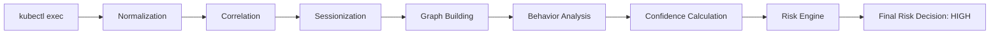

# TraceGuard Pipeline

## Overview

TraceGuard processes every event through the same seven-stage pipeline, regardless of whether it originates from Falco or the Kubernetes audit log. Each stage has a narrow, well-defined job: normalize, correlate, sessionize, build graph context, score behavior, score confidence, and finally fuse both scores into a risk decision. This document walks through each stage in order, then traces a single event through the whole pipeline to show how the stages compose.


| Stage | Input | Output | Primary Responsibility |
|---|---|---|---|
| 1. Normalization | Falco + Audit Logs | Unified events | Standardize heterogeneous sources |
| 2. Correlation | Unified events | Correlated events | Associate events with users |
| 3. Sessionization | Correlated events | Sessions | Capture behavioral context |
| 4. Graph Building | Sessions | Execution graphs | Represent execution relationships |
| 5. Behavior Analysis | Sessions + graphs | Behavior score | Identify malicious patterns |
| 6. Confidence Calculation | Behavior + correlation + graph | Confidence score | Estimate attribution reliability |
| 7. Risk Engine | Behavior + confidence | Risk decision | Produce explainable risk assessment |

> **Note:** The table above is a quick-reference map. Each stage is covered in full detail below, including the design rationale behind it.

## Stage 1 — Normalization

Falco and the Kubernetes audit log describe the same world in two incompatible vocabularies, and every stage downstream of ingestion needs to speak one language rather than two. Normalization exists to close that gap early, before any behavioral logic has to deal with it.

It takes in raw Falco syscall events and raw Kubernetes audit log entries, and works through field mapping between the two source schemas, timestamp normalization, and extraction of resource identity (pod, namespace, container). Where a field like `proc_cmdline` is missing from a Falco event, the normalizer falls back to an `action`-based representation rather than dropping the event — a small decision that turns out to matter later, since a dropped event can never be recovered by any subsequent stage.

The result is a set of `NormalizedEvent` records with a consistent schema across both sources. These records are what the Correlation stage searches over next, when it tries to work out which user produced a given runtime event.

## Stage 2 — Correlation

Falco has no concept of an authenticated Kubernetes identity — it sees processes and syscalls, not usernames. Correlation is where that gap gets bridged: for each Falco-origin event, the correlator searches nearby audit log entries using temporal proximity and matching resource identity (pod, namespace), scoring each candidate audit entry and retaining the top matches.

This produces `CorrelatedEvent` records, each carrying candidate users, attribution scores, an ambiguity measurement, and a final attribution state — one of `strong_match`, `weak_match`, `collision`, or `unmatched`. Rather than forcing a binary "matched or not," this stage preserves uncertainty as a first-class output, which later stages can weigh rather than ignore.

Correlated events, attribution state included, flow next into Sessionization, which groups them into windows of continuous per-user activity.

## Stage 3 — Sessionization

Attack behavior rarely lives in a single event — a sequence of individually low-signal events can add up to something suspicious once viewed together. Sessionization is the stage that makes that view possible, by grouping related events instead of evaluating them one at a time.

Events are grouped by `(user, pod, namespace)` and ordered chronologically; a new session begins whenever the gap between two consecutive events exceeds a configurable inactivity threshold. The output is a set of sessions — ordered sequences of correlated events sharing a user, pod, and namespace — which become the shared unit that both Graph Building and Behavior Analysis operate on next.

## Stage 4 — Graph Building

A flat event list loses the parent-child and dependency structure of process execution, and that structure carries real signal: an unexpected process relationship is itself suspicious, and a coherent dependency chain supports attribution confidence. Graph Building exists to recover that structure.

For each session, TraceGuard constructs a **Local Execution Graph**, where nodes represent processes and edges represent execution relationships. Edges are typed — temporal, semantic transition, continuity, burst proximity — and weighted according to how strongly two processes appear related. The resulting graph feeds into both Behavior Analysis and Confidence Calculation, one of the few points in the pipeline where a single output branches to two downstream consumers.

## Stage 5 — Behavior Analysis

Severity has to be assessed on its own terms. If it were entangled with attribution confidence from the start, a low-confidence attribution could end up masking a genuinely severe attack — so Behavior Analysis deliberately scores how malicious a session's activity is, independent of who it's attributed to.

Three complementary checks run against each session and its execution graph: pattern detection for known malicious sequences (reverse shells, cryptojacking), behavior classification for overall severity, and partial indicator assessment for incomplete attack chains.

> **Design note — dual-threshold strategy.** A lower **behavior threshold (0.25)** lets partial malicious indicators register at all, while a higher **pattern threshold (0.40)** is required before something is classified as a confirmed attack. Without this split, incomplete attack chains were frequently scored as benign because their pattern score never cleared a single, higher bar.

The output is a behavior severity score in `[0, 1]`, along with the specific patterns and indicators that contributed to it. This score becomes one of the two inputs to the Risk Engine, and it also informs Confidence Calculation indirectly through the session and graph context they share.

## Stage 6 — Confidence Calculation

Not every attribution is equally trustworthy, and treating every `strong_match` as interchangeable would throw away useful information. Confidence Calculation makes that variability explicit and measurable, drawing on correlation output, graph output, and session context to do so.

Five components are computed independently and then combined:

| Component | Formula | Evaluates |
|---|---|---|
| Timing | `exp(-Δt / τ_t)` | Temporal proximity between the runtime event and the audit action |
| Sequence | `exp(-(α·avgGap + β·maxGap) / τ_s)` | Coherence of event ordering within the session |
| Continuity | `exp(-maxGap / τ_c)` | Whether the session has large, confidence-eroding gaps |
| Ambiguity | `min(1, ratio × (1 + margin))` | How dominant the best attribution candidate is over rivals |
| PRS | `Σw / edges` (capped at 1.0) | Strength of process dependencies in the execution graph |

All `τ` time constants are calibrated per-dataset as the 80th percentile of observed values, which keeps the model adaptive without assuming a specific distribution. Base confidence is the mean of the five components; a +0.10 boost is applied when the Timing score is ≥ 0.8, and the final value is capped at 1.0.

The output — a confidence score in `[0, 1]`, together with the full breakdown of contributing components — is the second input the Risk Engine consumes.

## Stage 7 — Risk Engine

Analysts need one number to triage against, but that number only earns their trust if it can be unpacked back into the evidence that produced it. The Risk Engine's job is to fuse behavior and confidence into exactly that kind of defensible decision.

```
Risk = 0.7 × Behavior + 0.3 × Confidence
```

Behavior is weighted more heavily because detecting the attack is the primary objective — confidence reflects attribution reliability, not the presence of malicious activity. The result is classified as follows:

| Risk Score | Classification | Meaning |
|---|---|---|
| < 0.30 | LOW | Routine or benign activity |
| 0.30 – 0.60 | MEDIUM | Suspicious activity requiring further investigation |
| ≥ 0.60 | HIGH | Strong malicious evidence — escalation required |

The final output — risk score, classification, and the complete set of contributing sub-scores — is what reaches the analyst.

## Event Journey: A Single Event End-to-End

Consider a `kubectl exec` into a pod, followed by a shell spawning a reverse shell.



1. **Normalization** ingests the audit log entry for `kubectl exec` and the Falco events for the resulting `bash` process, `python -c` invocation, and eventual `nc -e` reverse shell — all mapped into `NormalizedEvent` records.
2. **Correlation** matches the Falco-observed `bash` spawn to the audit-observed `kubectl exec` based on timing and pod/namespace identity, producing a `strong_match` attribution to the user who ran the command.
3. **Sessionization** groups the `kubectl exec`, `bash`, `python -c`, and `nc -e` events into one session, since they fall within the inactivity threshold of each other.
4. **Graph Building** constructs a Local Execution Graph: `kubectl exec` → `bash` → `python -c` → `bash (child)` → `nc -e`, with the final edge flagged as a malicious pattern match.
5. **Behavior Analysis** recognizes the `bash → nc -e` sequence as a known reverse-shell pattern and assigns a high severity score, well above the 0.40 pattern threshold.
6. **Confidence Calculation** scores this session highly — tight timing, a clean sequence, no continuity gaps, no competing candidates, and a strongly connected execution graph all push confidence toward 1.0.
7. **Risk Engine** combines the high behavior score and high confidence score, producing a risk score above 0.60 and a HIGH classification, with the full evidence chain attached for the analyst.

## Pipeline Characteristics

**Fault tolerance.** Missing fields are handled by falling back to alternate representations (e.g., `action` in place of a null `proc_cmdline`) rather than dropping events. Unmatched attribution doesn't halt the pipeline — sessions with `unmatched` or `collision` states still flow through Behavior Analysis and the Risk Engine, just with reduced confidence.

**Reliability.** Each stage fails independently rather than cascading. A malformed audit entry degrades Correlation's output for that event without corrupting Sessionization, Graph Building, or any stage further downstream — the pipeline as a whole stays operational even when one input source is noisy or incomplete.

**Explainability.** Every risk decision decomposes cleanly into its contributing sub-scores, and every sub-score decomposes further into the components that produced it — timing, sequence, pattern matches, graph structure. An analyst is never handed a bare number; they're handed a number with its reasoning attached.

**Modular execution.** Stages communicate through well-defined record types (`NormalizedEvent`, `CorrelatedEvent`, sessions, graphs) rather than shared state, so any stage can be modified, replaced, or re-tuned without requiring changes to its neighbors.

**Independent stage validation.** Because each stage has a narrow responsibility and a typed output, it can be tested and validated in isolation — a change to confidence scoring, for instance, can be verified without re-running behavior analysis or graph construction.

**Known assumptions.** The pipeline assumes Falco and the Kubernetes audit log are both reachable and reasonably time-synchronized. It also assumes sessions can be meaningfully keyed by `(user, pod, namespace)` — highly dynamic or short-lived pods can stress this assumption.

**Current limitations.** Behavior Analysis is rule-based and won't catch attack patterns outside its known set. Sessionization is sensitive to the choice of inactivity threshold — a threshold that's too aggressive can fragment a single attack across multiple sessions, diluting the evidence in each. The pipeline has been validated against controlled scenarios rather than production-scale traffic.

**Possible future improvements.** A learned detection component to complement rule-based pattern matching; adaptive session-splitting that considers behavioral continuity rather than a fixed time gap; multi-cluster correlation for environments where a single actor spans multiple clusters.

## Related Documentation

- Overall system architecture: [`docs/architecture.md`](../architecture.md)
- Engineering rationale behind key design choices: [`docs/design-decisions.md`](../design-decisions.md)
