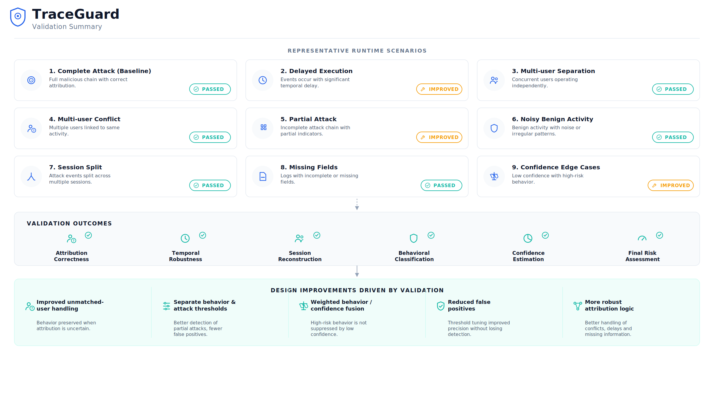

# System Validation

Validating TraceGuard isn't about producing an accuracy percentage — the pipeline fuses two fundamentally different kinds of evidence (behavioral severity and attribution confidence), and a single aggregate number wouldn't say much about whether either half is working correctly. Instead, validation here means running the pipeline against a set of realistic runtime scenarios and checking that each stage does what it's supposed to do: that attribution degrades honestly instead of silently failing, that behavior scoring catches both complete and partial attack chains, and that the final risk decision stays explainable and defensible even when the underlying evidence is messy or incomplete.

## Validation Approach

Each scenario was run through the full seven-stage pipeline, from raw Falco and audit log input through to a final risk classification, and the intermediate outputs at every stage were inspected — not just the final score. This mattered because TraceGuard's core design bet is that behavior and confidence should move independently: a scenario is only really validated if the behavior score, the confidence score, and the risk decision all behave the way the architecture intends, not just the last one.

Validation covered five areas in particular:

- **Attribution correctness** — whether the correlation layer assigns the right user (or correctly reflects ambiguity) under timing delays, multi-user activity, and conflicting candidates.
- **Behavioral analysis** — whether known attack patterns, partial attack chains, and benign-but-noisy activity are classified the way they should be.
- **Confidence estimation** — whether the five-component model responds sensibly to weak timing, session gaps, and competing attribution candidates.
- **Risk assessment** — whether the final fused score preserves strong behavioral evidence even when attribution is uncertain, per the separation-of-concerns principle the architecture is built around.
- **Pipeline robustness** — whether missing fields, fragmented sessions, and other messy real-world conditions degrade gracefully instead of breaking the pipeline outright.

## Test Environment

| Component | Role |
|---|---|
| Python | Core implementation language for all seven pipeline stages |
| Kubernetes (K3s) | Deployment and validation environment for the pipeline |
| Falco | Runtime event source — syscall-level behavioral evidence |
| Kubernetes Audit Logs | Attribution source — authenticated user actions |

Scenarios were constructed from Falco and Kubernetes audit log data and processed through the pipeline end-to-end, rather than run against live attacks in a production cluster.

## Validation Scenarios

| Scenario | Validation Objective | Result | Engineering Notes |
|---|---|---|---|
| **Clean Attack** | Confirm the full pipeline detects a complete malicious chain and attributes it correctly under ideal conditions. | Passed | Served as the baseline — high behavior score, high confidence, HIGH risk, correct user attribution. Validated that the pipeline works correctly before stress-testing edge cases. |
| **Delayed Execution** | Confirm attack behavior is still recognized when correlation timing is stretched, and that reduced attribution certainty is reflected without losing the behavioral signal. | Improved | Initially, an unmatched user could drag confidence to zero and mask a real attack. Resolved by treating an unmatched user as a signal to fall back on behavior alone for risk estimation, rather than letting a failed attribution zero out the decision. |
| **Multi-User Separation** | Confirm that concurrent, independent user sessions on the same pod are correctly isolated and attributed. | Passed | Sessions stayed isolated with no cross-contamination between users, confirming correlation and sessionization hold up under concurrent activity. |
| **Multi-User Conflict** | Confirm the system reflects genuine attribution ambiguity rather than forcing a single guess when candidates are closely matched. | Passed | Competing candidates were retained rather than collapsed into a false single match; the ambiguity component brought confidence down while the behavior score stayed unaffected — attribution uncertainty didn't get to hide malicious evidence. |
| **Partial Attack** | Confirm an incomplete attack chain still registers as suspicious instead of being scored as benign. | Resolved | Early behavior scoring cleared a single pattern threshold poorly, so incomplete chains were frequently scored as benign. Resolved with a dual-threshold split — a lower bar (0.25) for partial indicators to register, a higher bar (0.40) before something counts as a confirmed attack pattern. |
| **Noisy Benign** | Confirm ordinary, slightly irregular benign activity doesn't get escalated. | Passed | The same dual-threshold logic that fixed Partial Attack also kept noisy-but-legitimate sessions from tripping into MEDIUM or HIGH risk, without needing separate tuning. |
| **Session Split** | Confirm the impact of an attack getting fragmented across multiple sessions by an aggressive inactivity threshold. | Passed | Evidence from a single attack can end up distributed across sessions, which can understate risk if the inactivity threshold is set too tight. Behavior held up correctly within each fragment; threshold tuning is called out as an operational consideration rather than a pipeline defect. |
| **Missing Fields** | Confirm the pipeline keeps running when expected fields (e.g. `proc_cmdline`) are absent from a Falco event. | Passed | The normalizer's fallback to an `action`-based representation held up — processing continued without failure, with confidence reduced to reflect the weaker evidence rather than the event being dropped. |
| **Confidence Edge Cases** | Confirm that very low confidence doesn't suppress a high-severity behavior score in the final risk decision. | Resolved | The original strict-multiplication fusion (`Risk = Behavior × Confidence`) let low confidence drag a severe attack down to a low risk score. Replaced with weighted fusion (`Risk = 0.7 × Behavior + 0.3 × Confidence`), which keeps strong behavioral evidence visible while still letting confidence meaningfully move the score. |

## Key Design Improvements Identified During Validation

A few structural changes came directly out of running these scenarios rather than out of upfront design work:

**Attribution fallback for unmatched users.** The Delayed Execution scenario showed that a failed attribution shouldn't be allowed to zero out an otherwise valid risk assessment. When a user can't be matched, the pipeline now falls back to behavior-only risk estimation instead of letting a missing attribution suppress the decision.

**Dual-threshold behavior scoring.** Partial Attack and Noisy Benign both pointed at the same underlying problem: a single pattern threshold forces a tradeoff between catching incomplete attacks and avoiding false positives on legitimate activity. Splitting behavior scoring into a lower threshold for partial indicators and a higher one for confirmed patterns resolved both at once, since they were really the same tuning problem viewed from opposite directions.

**Weighted risk fusion over strict multiplication.** Confidence Edge Cases exposed the sharpest issue in the original design — multiplicative fusion meant a low-confidence attribution could make a clearly malicious session look safe. Moving to a 0.7/0.3 weighted sum kept behavior as the dominant signal while still letting confidence shape the outcome, which lines up with the architectural principle that confidence should describe attribution reliability, not gate whether malicious behavior gets reported at all.

**Ambiguity as a first-class signal.** Multi-User Conflict confirmed that collapsing attribution into a single best guess would have thrown away real information. Keeping candidate scores and an explicit ambiguity measurement, rather than forcing a binary match/no-match outcome, turned out to matter as soon as more than one plausible user existed.

## Validation Summary

Across these scenarios, the pipeline consistently demonstrated the separation the architecture is built around: behavior severity and attribution confidence moved independently, and the risk engine combined them without letting either one silently override the other. Attribution degraded honestly under timing delays, missing fields, and competing candidates instead of failing outright or masking uncertainty. Behavior analysis caught both complete and partial attack chains while leaving genuinely benign, if noisy, activity alone. The two issues that did surface during validation — confidence zeroing out risk on unmatched users, and multiplicative fusion suppressing severe behavior under low confidence — were both traced to their root cause and resolved with targeted architectural changes rather than workarounds.

## Current Validation Limitations

- Scenarios were constructed to exercise specific pipeline behaviors rather than drawn from large-scale production traffic, so validation reflects representative conditions rather than production-scale load or diversity.
- All validation was run in a single-cluster environment; cross-cluster attribution and correlation haven't been exercised.
- Behavior Analysis is rule-based and was validated against known attack patterns; detection of novel techniques outside that pattern set hasn't been — and by design, can't be — assessed by this validation process.
- Thresholds (behavior/pattern thresholds, inactivity gap, risk fusion weights) were manually tuned against these scenarios rather than learned, so they may need revisiting for workloads that look meaningfully different from the ones tested here.
- Broader validation against production-scale, multi-cluster traffic remains future work.

## Related Documentation

- **[architecture.md](architecture.md)** — the structural view of the pipeline: components, data flow, and module boundaries. Useful background for understanding what each scenario above was actually exercising.
- **[pipeline.md](pipeline.md)** — stage-by-stage mechanics, including the confidence model formulas and the dual-threshold strategy referenced throughout the scenarios above.
- **[design-decisions.md](design-decisions.md)** — the reasoning behind the choices validation ended up confirming or revising, including the original rationale for strict-multiplication fusion and why it was replaced.

Together, these three documents cover the *what*, the *why*, and — with this one — the *does it actually hold up* of the system.
